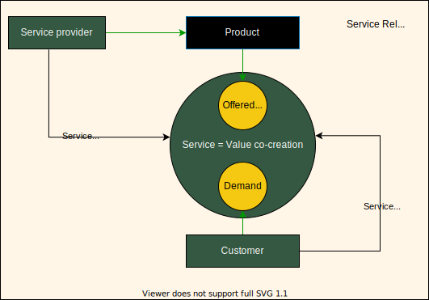

# ITIL concepts
## Consumer

## Product and service

Service provides present their services to consumers in the form of service offerings, which describe one or mode services based on one or mode products.

But other sources may have another view to services

At the same time, a differentiation between a general service (e.g., the installation 
service of a service technician), a technical service (e.g., the transmission service of
a mobile network) and a service as a product (e.g., consisting of general and
technical services) is important. In fact, the term service is used for all three different types.

. From an economic perspective, the telecommunications industry belongs to
the service industry and, accordingly, a service will be provided to the customer
(Zeithaml and Bitner 2003, p. 3). As shown in Fig. 2.14, only a subset of the
services is perceived by the customer. All other services are executed within the
telecommunications network as well as the telecommunications system, and are not
visible to the customer

product should be used to
describe a telecommunication service that is provided to a customer

# Four dimension service management

The for dimensions do not have sharp boundaries and may overlap.

## People

* Roles and responsibilities 
* Formal orgenizational structures
* Culture
* Required staffing and competences

## Technologies

***Support service management***
* workflow management system
* knowledge bases
* inventory systems
* communication systems
* analytical tools

***in context of specific IT service***

* Information created
* technologies that support service
* How information is exchanged between services

## Partners and Suppliers

## Value streams

* Activities
* Workflows
* Controls
* Proceduers

# Service Value System

The erchetecture of ITIL SVS specifically enables flefibility and discourages siloed working The service value chain activities and the practices in the SVS do not for, a fizex, rigid structure.

An organization can take any number of forms includng but not limited to, sole traiderm companym corporation, firm enterprise authority etc.. 
To acheive the maximum value from the SVS and to properly address the issue of organizational silos, it is preferable to include the whole organization in the scope rather that a subset

## Guiding principles

Example CSI mapped to Guiding principles:

## Governance
Orgaization governance is a system by which organization is directed and controlled.
Actions: 

* Evaluate
* Direct
* Monitor

## Service Value Chain

The purpose of the plan value chain activity is to ensure a shared undertanding of the vision, current status, and improvement direction for all tour dimensions and all products and services across the organizaiton.

## CSI

