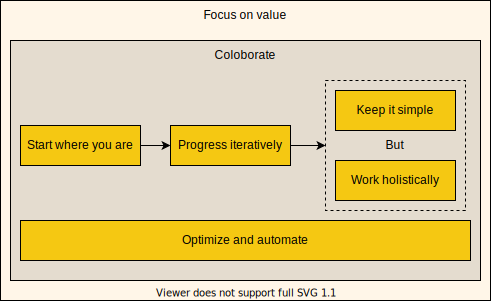
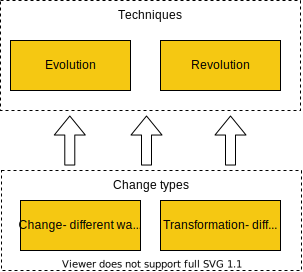

# ITIL concepts
## Consumer

**Conceptual map of Demand to Value part**

## Product and service

Service provides present their services to consumers in the form of service offerings, which describe one or mode services based on one or mode products.

But other sources may have another view to services

At the same time, a differentiation between a general service (e.g., the installation service of a service technician), a technical service (e.g., the transmission service of a mobile network) and a service as a product (e.g., consisting of general and technical services) is important. In fact, the term service is used for all three different types.

From an economic perspective, the telecommunications industry belongs to
the service industry and, accordingly, a service will be provided to the customer (Zeithaml and Bitner 2003, p. 3). As shown in Fig. 2.14, only a subset of the services is perceived by the customer. All other services are executed within the telecommunications network as well as the telecommunications system, and are not visible to the customer product should be used to describe a telecommunication service that is provided to a customer.

# Four dimension service management

The for dimensions do not have sharp boundaries and may overlap.

## People

* Roles and responsibilities 
* Formal orgenizational structures
* Culture
* Required staffing and competences

## Technologies

***Support service management***
* workflow management system
* knowledge bases
* inventory systems
* communication systems
* analytical tools

***in context of specific IT service***

* Information created
* technologies that support service
* How information is exchanged between services

## Partners and Suppliers

## Value streams

* Activities
* Workflows
* Controls
* Proceduers

# Service Value System

The architecture of ITIL SVS specifically enables flexibility and discourages siloed working The service value chain activities and the practices in the SVS do not for, a fixed, rigid structure.

An organization can take any number of forms including but not limited to, sole traders, company, corporation, firm enterprise authority etc... 
To achieve the maximum value from the SVS and to properly address the issue of organizational silos, it is preferable to include the whole organization in the scope rather that a subset

[ITIL SVC Inputs and outputs](../docs/ITIL_SVC_IN_OUT.htm)

## Guiding principles

Example CSI mapped to Guiding principles:

## Governance
Organization governance is a system by which organization is directed and controlled.

Actions: 
* Evaluate
* Direct
* Monitor

## Service Value Chain

The purpose of the plan value chain activity is to ensure a shared understanding of the vision, current status, and improvement direction for all tour dimensions and all products and services across the organization.

## CSI

## Organizational structures types

  

In the digital service economy agilty and resilience ave vital for an organizational's success. Organizations must adopt new ways of structing their resources and competence. Common approach include:
* the faster and mode flexible allocation of resources to new or more important tasks.
* permanent simple multi-competent teams that are assigned to work exclusively on a product

## Building affective team

### Competency codes and profiles (LACMT)

Skills in service management:
1. Communication
2. Business and commercial
3. Relationship management
4. Leadership
5. Market and organizational knowledge
6. Management and administration
7. Developing innovation
 
(to be continued)

## Organizational Change Management (OCM)
>OCM does not aim to unify all the changes in an organization into one big picture - there is neither possible or required.

> People are responsible for changes in behaviour as a responsible to changes circumstances - the system in which we work

### Value-driven approach VS Plan-driven approach
ITIL is advocate value driven approach and doesn't ever mention other types of approaches.  

[PDF - Article: Value-Driven or Plan-Driven](../docs/Value-driven%20VS%20plan-driven.pdf)

[PDF - The Importance of Values in Building a
High-Performance Culture](../docs/Article_Importance_of_Values.pdf)

## Evolution, Revolution (not ITIL), Change, Transformation.

## Relationship Systems Intelligence™
>Relationship Systems Intelligence™ incorporates Emotional and Social Intelligence and then expands
the focus to a larger paradigm, the capacity to see oneself as part of a Relationship System. A
Relationship System is an interdependent group of people with common identity or function.
Identifying with and aligning with a system is a holonic shift up from simply connecting effectively
others. It is the difference between relating with bunch of individuals in a group, to seeing the group as
a single integrated whole.

### Steps for RSI:
1. Practicing Deep Democracy where all voices in a system are heard and honored,
including the unpopular ones.
2. Practicing Appreciative Inquiry where one builds on ideas after appreciating what was
said by the other parties.
3. Increasing positivity on a team until there is a 5:1 ratio of positive-to-¬negative
interactions (Gottman 2002).
4. Decreasing negative interactions with softer start ups in difficult conversations and both
understanding and using repair bids (Gottman 2002).
5. Increasing positivity during conflict so that a lighter field is held, even during serious or
difficult conversations.
6. Avoiding toxic communication styles including: blaming, defensiveness, stonewalling,
contempt and controlling (Gottman 2002).

* [An Introduction to Relationship Systems Intelligence](https://www.teamcoachingzone.com/wp-content/uploads/2015/01/RSI-White-Paper.pdf)
* [CRR Global](https://crrglobal.com/about/rsi/)

--------------
#f5c812
#345841
#e4dccf
#cba870
.

