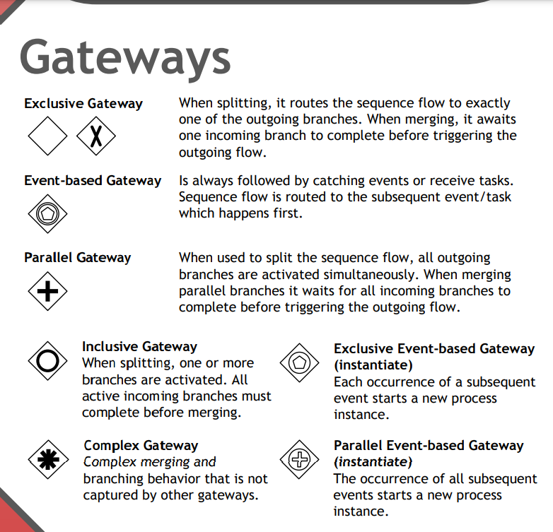
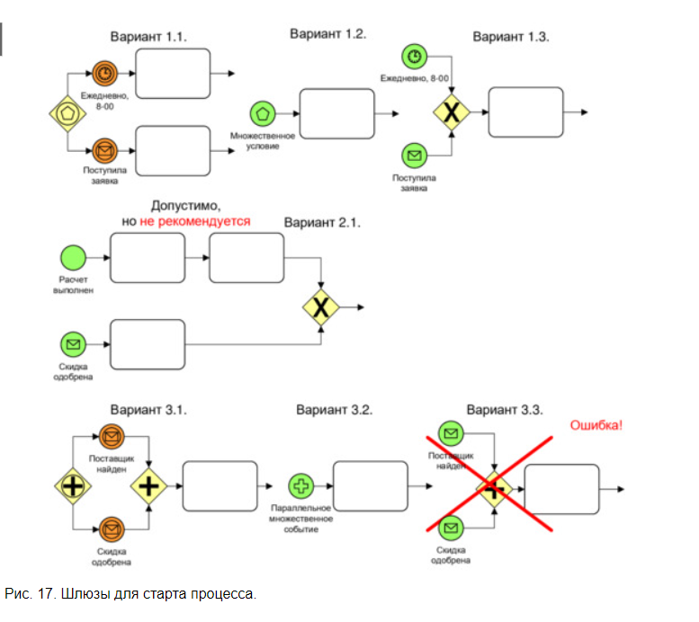
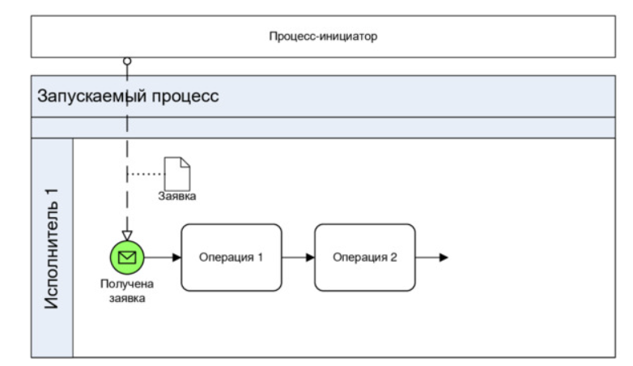
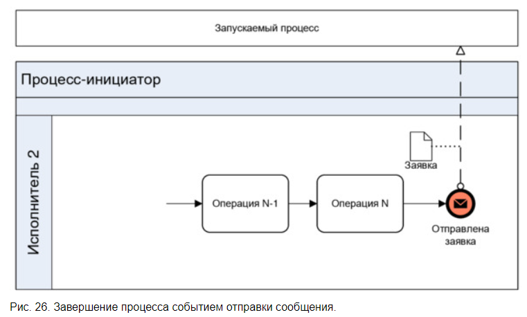
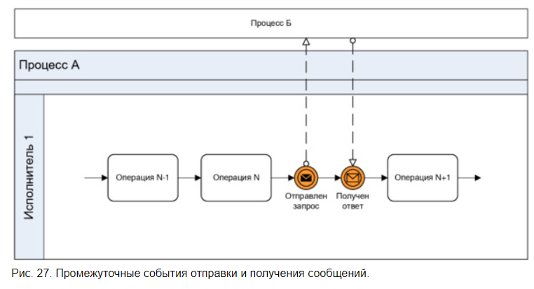
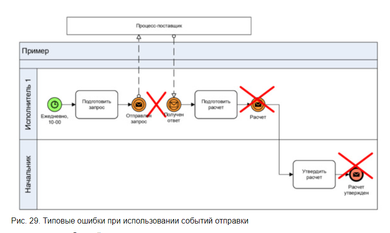
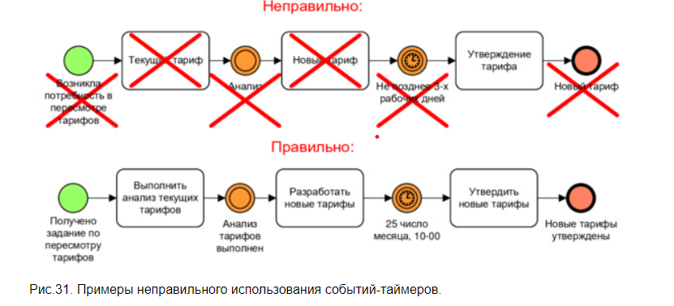
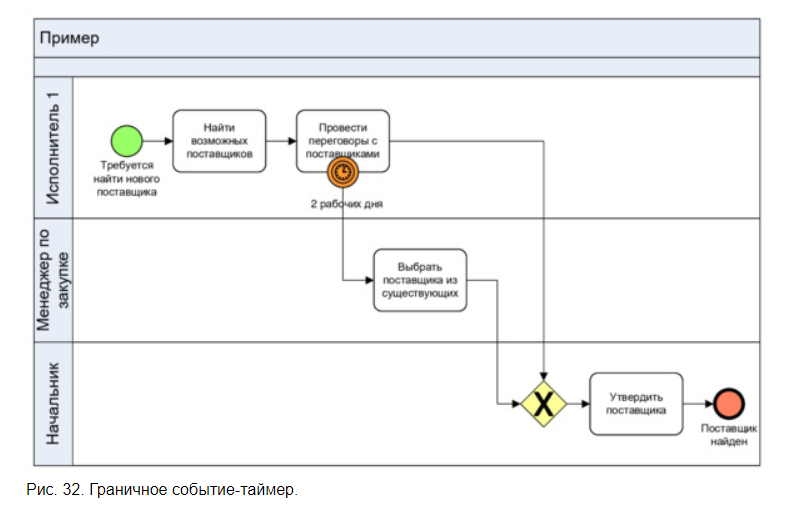
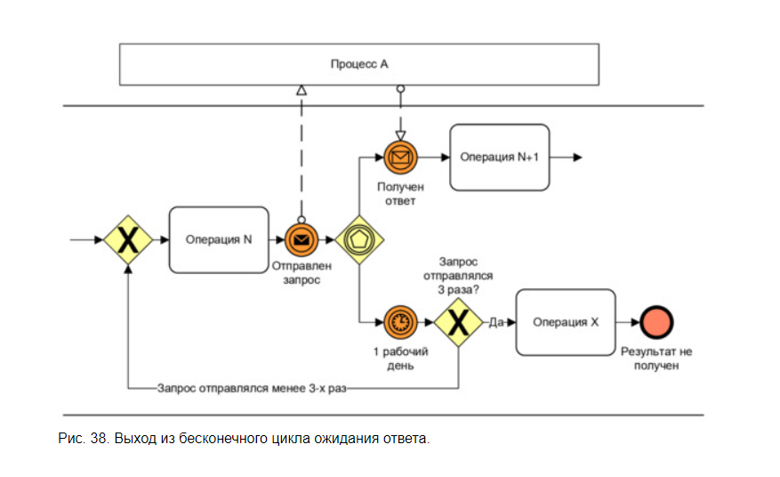
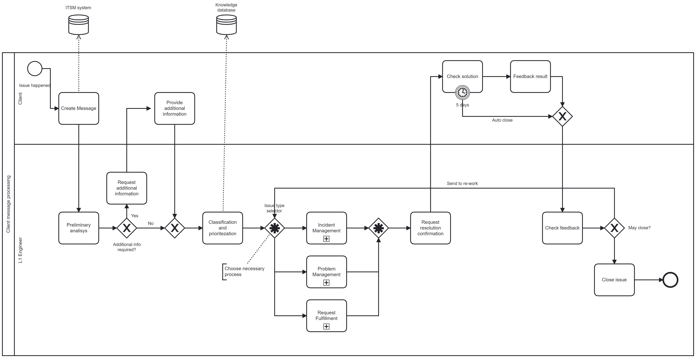

# Проектирование процессов в BPMN
> *Конспект книги Репин В. Моделирование процессов в нотации BPMN. Пособие для начинающих. Часть 1 + Дополнительные материалы*>

-------
Перед тем, как начать надо определить:
1. Цель
2. Точка зрения
3. Метод описания

### Важные идеи:

* Если мы начинаем построение схемы процессов, то лучше всего начинать с цепочки создания ценности организации. Можно сделать в нотации IDEF0.

* BPMN изначально не предназначен для моделирования потоков документов. Поток документов не заменяет поток работ.
* Количество экземпляров процесса, которые могут быть выполнены за единицу времени является  ***мерой производительности процесса***
* В организации должно быть соглашение о моделировании.
* Общее количество операций не схеме не должно превышать 10-15.
* Хотя по нотации не запрещено рисовать несколько входов\выходов из блока, но  это делать **не рекомендуется**

## Стартовые и конечные события

* У процесса может быть несколько стартовых событий
* У процесса может быть несколько конечных событий

## Типы шлюзов
Важно! Шлюз не может объединять и разветвлять несколько потоков одновременно [1]
Тем не менее, это встречается сплошь и рядом. Возможно, для подобного ветвления лучше использовать Complex gateway.

**Шлюзы для старта процессов**

**Старт по заявке**

**Окончание заявкой**

**Обмен сообщениями**
Не желательно на схеме злоупотреблять событиями отправки сообщений. Использовать только, когда необходимо. 

)

**Типовые ошибки**

**Использование таймеров**

## Граничные события-таймеры
Если процесс "Провести переговоры с клиентом" выполняется более, чем 2 дня, то запускается ветка "Выбрать поставщика из существующих"

Нельзя этим событием показывать нормативное время выполнения процесса.

## Пример использования сложного шлюза

## Формальная оценка качества процесса
Проверить на соответствие
* Корректность формулировок названий объектов на схеме
* Корректность описания входов\выходов
* Корректность описания событий
* Логические ошибки
* Физическая нереализуемость
* Возврат в прошлое
* Не учтена необходимость обработки нескольких объектов
* Наличие "процессной грыжи"
* Однородность масштаба операций
* Визуальная наглядность
----------
## Мои работы
### Процесс обработки сообщений клиента (Camunda modeler)

------
***Материалы:*** 
1. [Репин В. Моделирование процессов в нотации BPMN. Пособие для начинающих. Часть 1](../Resources/pdf/Repin_V._Modelirovanie_Biznes_Proc.epub)
2. [BPMN 2.0 poster](http://www.bpmb.de/images/BPMN2_0_Poster_EN.pdf)
3. [Camunda modeler - software ](https://camunda.com/download/modeler/)
4. [Interview Questions for Business Analysts and Systems Analysts](https://www.modernanalyst.com/Careers/InterviewQuestions/tabid/128/articleType/CategoryView/categoryId/40/Business-Process-Modeling-Notation-BPMN.aspx)