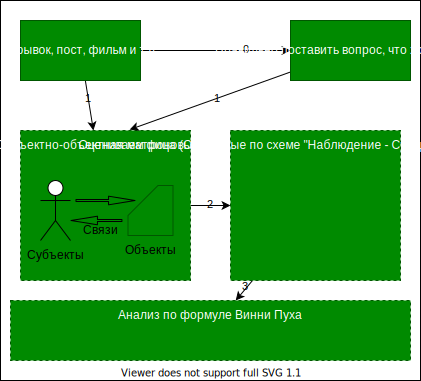

# Мышление и Действие
## Вступление 
Кто-то мыслит действенно, а кто-то недейственно.
Для человека - узнать что-то новое, это стать физически другим человеком, так как происходит физическое перестроение клеток.

Мозг думает облаком - обрывки образов, картинок и т.п..  
А когда мы мыслим, мышление - дискретно - надо собирать в последовательность рассуждений. Так же как и речь. Это сложно. 

Мышление - это сложно. Это волевой акт, который следует дискретно по определенным правилам и приводит к практическим результатам (один или несколько)
Вы:
1. что-то узнали
2. изменили к чему-то отношение
3. что-то сделали
Если направлено на кого-то, то тот человек
 должен:
1. Что-то узнать
2. Изменить отношение
3. что-то сделать

Подсознательно человек задает и имеет вопросы на ответы:
"Индивидуальное бессознательное"
1. Кто я? 
2. Где я?
3. В каких отношениях мы находимся?
4. Зачем?

Есть еще коллективное бессознательное. 
В основном на эти вопросы концепции отвечают на эти вопросы. (Например, религиозные концепции)

Разум, воля, эмоции - всегда идут вместе. 

Человек, который собрался что-то делать или мыслить сталкивается с грандиозным сопротивлением.

Мышление сложно - себе заставить и внешние условия преодолеть.

Люди имеют 5 основные этических (моральных систем\концепций):
1. Этика чести (н-р, воинская профессия. Служение чему-то высокому. Кол-во принципиальных поступков)
2. Разум (хочу все знать, меряет, сколько узнал)
3. Концепция воли (преобразования воли. На что и как ч-к направляет свою волю. Не оч. понятно)
4. Святость повседневной жизни (мой дом самый чистый, улицы без мусора и т.п. Марксизм. Святость труда, святость семьи. Святость труда)
5. Натуралистический подход (считает, что 1-4 - не существует)

В человеке сочетаются 1-4 в разных пропорциях. Выбрать невозможно, надо понять.  

Коммуникация и кооперация - наши основные средства приобретений и потерь.
Чтобы что-то достигнуть, нужно найти человека и обработать его.

Если работаем с человеком, необходимо подумать:
1. кто он? 
2. зачем он суетится? 
3.  в каком мире он живет?
    1.  Кем он себе считаем в этой системы (обычно 2-3 системы)

 **Правило ДИКС:**
 1. Деньги
 2. Идеи
 3. Компромат (нэ этично. Не рассматриваем)
 4. Связи

Когда хотим от человека что-то, надо ориентироваться на ДИКС. Самое лучшее, если работать на Идее либо Деньги + Идеи.

# Подготовка к мышлению
3 базовые схемы
1. Субъекты объекты связи
2. Наблюдение  суждение оценка вывод
3. поиск наилучшего объяснения (формула Винни Пуха)

## Выходит в лес подрепиться. Натыкается на дуж, там жужжание. Винни говорит, 
Он наблюдает:
1. Само дерево не жужжит ( а откуда он знает? Он не знает все деревья, не жужжат. Но это может быть фоновое знание)
2. Значит кто-то там жужжит (могут жужжать 10 видов насекомых, но он выбирает пчелу, так как у него была ЦЕЛЬ рассуждений. Это ДИАПАЗОН РАССУЖДЕНИЙ)
3. А зачем тебе жужжать ,Если ты не пчела
4. А зачем на свете пчелы, чтобы делать мед
5. А зачем на свете мед - затем, чтобы я его ел. 

ФОНОВОЕ ЗНАНИЕ  (конструируемые и изначально присутствующие)
КТО-ТО (Субъект)
ДИАПАЗОН ОТБОРА (согласно ЦЕЛИ РАССУЖДЕНИЙ (Не имеете цель, не надо начинать мыслить))
3-5 так же диапазон отбора согласно цели.

Появляется понятие самого простого и вероятного объяснения 

**Формула Винни-Пуха:**

ФОНОВОЕ ЗНАНИЕ(конструируемые и изначально присутствующие) х
самое простое объяснение х
самое вероятное объяснение х
цель
=ГИПОТЕЗА

Бритва Оккама - не премножайте сущности, необходимые для объяснения. 

Может быть схема на единичных объяснениях дает сбой, но в долгосрочной перспективе - она верна.

Накопление фоновых знаний крайне важно.
если это переносить на социальную сферу, то получаем следствие:

95% бесед, совещаний - это согласование фоновых данных
многие споры - это согласование фоновых знаний.

"Договориться на берегу", "договориться о терминах" и т.п.

"Преобразовывать реальность"

Если есть время, можно конструировать фоновые данные.

## Наблюдение-Суждение-Оценка-Вывод (НСОВ)
Наблюдение - когда мы определили судьекты и объекты.
Субьекты- люди
Обекты- неодушевленные вещи

Суждение -первичное умозаключение, когда мы определилки как субъекты связана  объектами и установили их связи.

Несколько наблюдений - одно суждение

НЕколько суждений - дают оценку. 

Оценка - умозаключение, которое имеет качественное или\и количественное характеристики.

Несколько оценко дают обин вывод

Естественный диапазон человек от наблюедение - суждение.
Т.е. прыгаем от наблюдения к выводу.

Очень часто люди домысливают. Функционально делят тех , кто добывает информацию и тех, кто делает выводы, так как они могут делать более взвешенные выводы.

"если что то плавает как утка крякает как утка выглядит как утка , это утка но не точно"

Принцип фальсификации.
Ученые в середине 20 века достили такого объема, и сли мы тратим усилия, чтоы подтвердать что все вороны черные, надо тратить усилия на то, чтобы найти нечерные вороны.

Усилия надо сосредоточить на противоположном от того, что мы хотим доказать.

*Принцип:* Обращаем внимание на отсутвие обычного и присутствие необычного.

Чтобы определить объект, надо определить частью какого целого он является и определить основные его системообразующие признаки, делающие его этой вещью (1,2,3-5)

)

## Мировоззрение
Кто я?
Где я?
В каких отношениях я отношусь?

Люди спонтанных отождествлений 

Невежество - отсутсвие привычки думать.

----------

Идея - Желание - Намерение - Планирование - Действие

Желание неопределенно, требуется опредмечивать -> намерение 
намерения без предмета не существует

Какие желания опредмечивать и выполнять? 
Выполняем не все!

Хочу  есть, но решил поголодать.

Рефлексивное управление - формируют у вас желание и подсовывают вам предмет.

Маркетнг опредмечивает наши желания. 

Самый важный и сложный этап - понять, чего я хочу и опредметить.

## 
Привычка искать готовое
Неумение рассуждать (личное мнение- ни о чем. Нужны аргументы, а еще лучше цепочка обоснований)
Страх ошибиться (поднимают руку только тогда, когда есть ответ)
Любая  критика идей означет, что их работу плохо оценили
Поиск правильного ответа. А не дискуссия. 
Критика - социальная смерть. 
Изменить свою точку зрения - потерпеть поражение в бою.
Информация неоспорима 
Поиск скрытых смыслов
никто не хочет работать с черновиками

это сводится к 
1. Вера в то, что есть 1 правильное мнение
2. Нет влияния не прислушиваются
3. Приравнивание критики к социальному наказанию

> Стратегические цели надо завышать, а тактические занижать!
Путают амбиционные цели и задачи. Задачи д.б. выполнимыми. 

Стратегические цели - стратегическое планирование - тактические планы

----------
 идеи это наше
главное инструментами это наши главные инструменты с помощью
которых мы мыслим 
теперь следующий важный шаг дело в том что мы так устроены что не можем прямо
относиться к реальности к действительности мы не можем прямо взаимодействовать с миром на нас с вами

на нас произошел этот сбой природы мы можем действовать только посредством идей идеи это важный фактор и назвал их
инструментами без которых мы не можем ставить не цели не понимать зачем нам
это нужно не спокойно существовать не изготовлять необходимые инструменты для

инструмент с другой стороны очень опасны потому что в большинстве из нас идеи
действуют спонтанно они притаились они не видны их влияние
незаметно это также одна из функций философии расколдовывать расшифровывать

этот второй момент без идей мы не можем идеи наши главные инструменты наше главное посредники среди за этим третий

идеи не существуют материальным образом или по другому говоря
идеи удивительным образом нематериален это не физические факты и события

хочет потреблять смыслы и идеи вывод такой если идея не
физические нематериальные идеи это то к чему мы должны прийти сами
активно действуя как активное существа
идеей даются в руки тех кто активный кто работает над ними то
пытается их выявлять кто пытается их создавать поскольку они нематериальны и
они требуют нашей работы это инструменты которые мы постоянно шлифуем это
инструменты взаимодействия с миром над которыми нужно постоянно работать а кому это понравится кому понравится нам

может у вас будут вопросы да я ещё хотел сказать что идеи не гуляют сами по себе
идеи дружат вместе образуя истории идея
часть истории можете себе если у вас есть конспекты нарисовать красивый
кружочек ну так идея рядом кружочек еще иди рядом еще идея эти идеи изначально донаучной фазе
существовали как повествование мифы истории когда возникла философия и наука
эти идеи стали создавать новые сообщества концепции теории
гипотезы каждая идея часть какой-то концепции каждая идея часть какого-то
повествований сами по себе они не бродят сами по себе ничего не значит вот

истории среди с этими наша общая тема мышления говорит о том что мы мыслим
соединяя идеей вот просто что такое мышление мышление это соединение идеи
понимание как идеи связаны как они взаимодействуют как они создают содружества планетарные
системы галактики как они образуют истории теории гипотеза мышление это
соединение что мы соединяем идеи отдельные мысли в любой из этих историй

5 важных идей
Реальность
когда мы говорим реальность мы складываем о всем что мы видим определенную историю реальность это
всегда некая целостность ну давайте вначале посмотрим главной модели это реальность первая из них все возникают в

это типичный пример повествовательного мифического понимания реальности
кто-то ее держит мир сохраняется потому что он управляется существами его
древние философы сказали нет это чепуха народная реальность другая на место
богов нужно поставить некие силы и эти силы понимаются как некие
фундаментальные элементы огонь например воздух числовые соотношения 1 модель
реальности это совокупность базовых элементов
который образует некую целостность и для

---------
**Материалы**
1. "День шакала"
2. Тейлор Чарльз - Джерела Себе
3. ЗВездный десант
4. Час быка
5. 