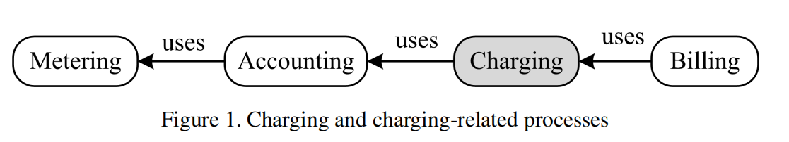

# BSS
[Nexign CBSS Schema - drawio ](Images/CBSS_Nexign_architecture.drawio)
## CHARGING-RELATED TERMINOLOGY 
 There are four terms that refer to the most important charging-related processes. 
1. **Metering** refers to a process that collects information about resource usage at a
particular network element. 
2. **Accounting** uses metering logs to aggregate information about resource usage from different network elements. 
3. **Charging** refers to a process of calculating a cost, expressed in units acceptable for network management processes, of a given service consumption, by using the accounting information. 
4.  Within the **billing** process, the charges are collected, and the service payment procedures are managed towards the party that consumed the service(s).

[More details "An overview of online charging in 3GPP networks: new ways of
utilizing user, network, and service related information"](pdf/OCS_review_terms_of_BSS.pdf)

## Catalog-driven approach
A catalog-driven charging architecture allows templates that are built into the online charging system – including resources and customer-facing services – to be re-used among different products, offers and bundles with their specific configuration and price specifications. Going back to our automotive example, it means that the customer would be able to replace a flat tire, or the manufacturer could quickly launch a new version of the car with a newly built engine. It is simple and obvious for them, but not quite as straightforward for telecom businesses. On top of this, the so called “Lego block” components reuse other benefits of this architecture including the centralization of product definition and deployment, the exposure of product catalog information through real-time APIs to an external commercial catalog or other external system, and the capacity to manage the entire product lifecycles in one place. All these enhancements combined unlock unprecedented business agility in product design, configuration, testing and launch – and improved operational excellence with reduced charging errors and issues resolution time.
https://www.ericsson.com/en/blog/2020/5/what-is-catalog-driven-charging-for-bss-and-what-are-its-benefits

A Product Catalog works as a central configuration point for all the product and offering information, enabling a streamlined process for introducing new offerings with short time-to-market. 

**Reading:**
1. [Product catalog](https://www.alepo.com/revolutionizes-telcos-bss-offerings/)
2. [unified digital fremework](https://www.linkedin.com/pulse/part-3-udx-unified-digital-transformation-framework-facts-el-safadi/)
3. 

**For read**

 omni-channel and multi-touchpoint customer experience
 partner ecosystem
 revenie streams

