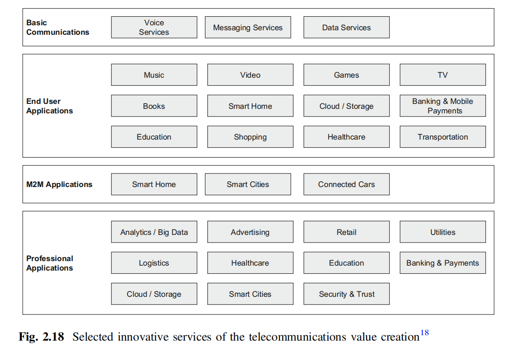
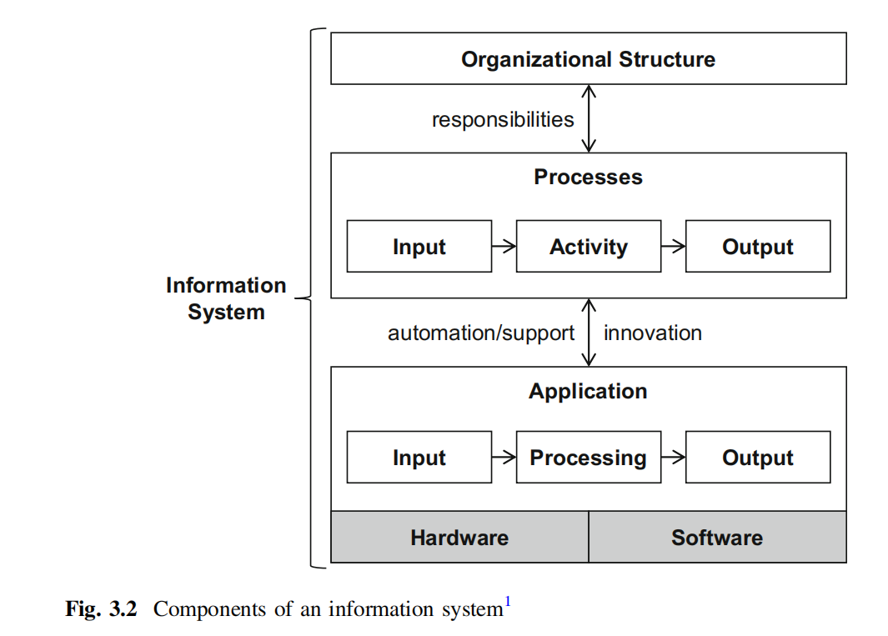
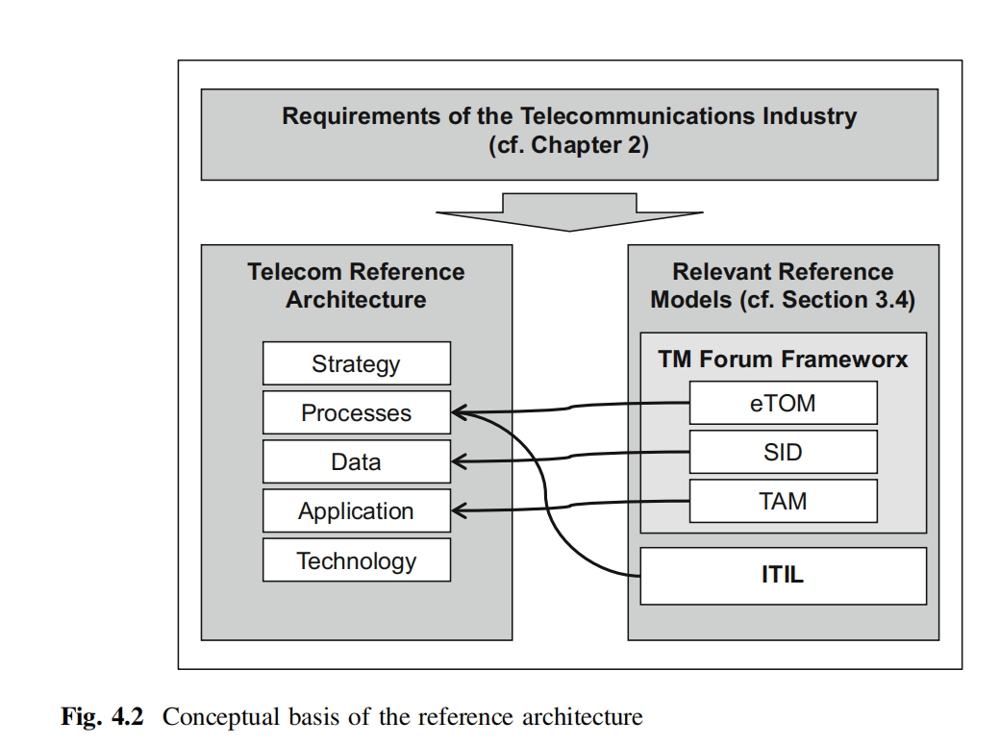
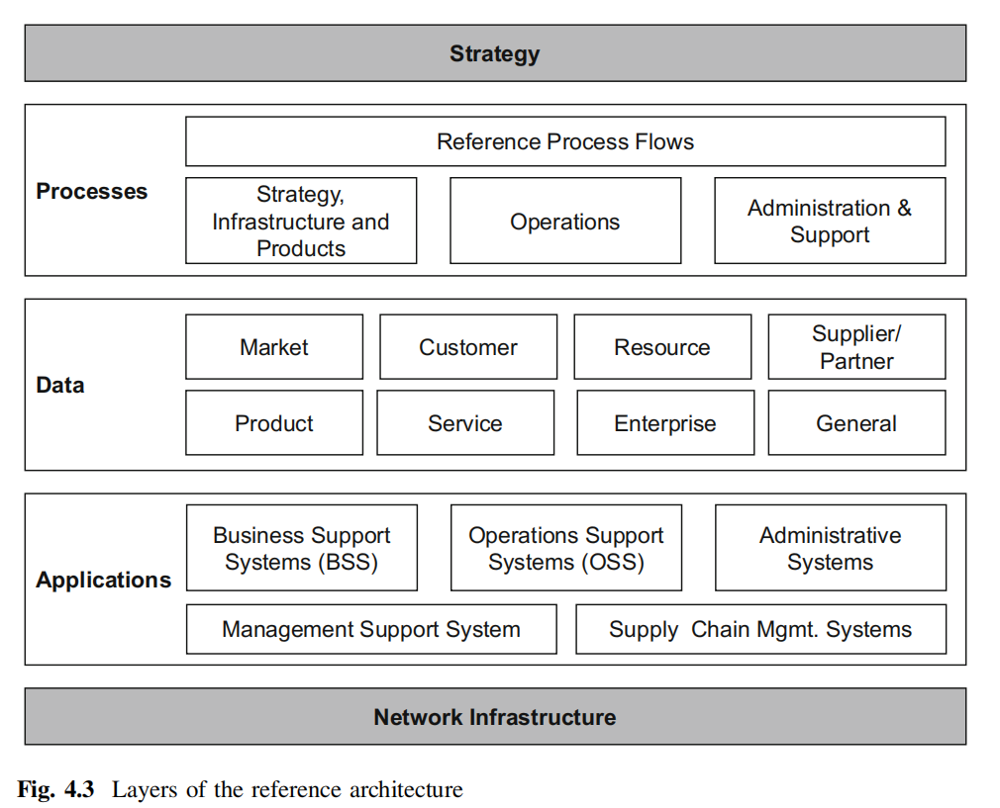
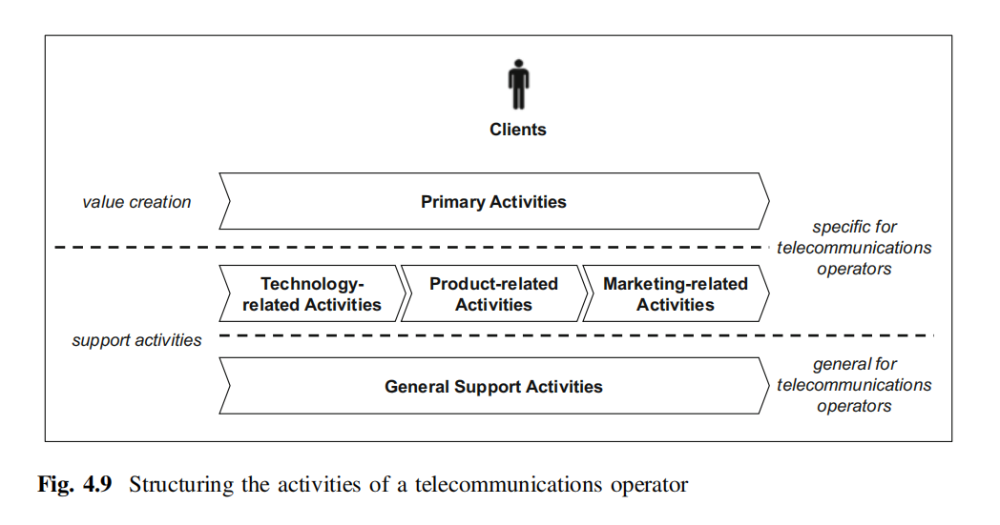
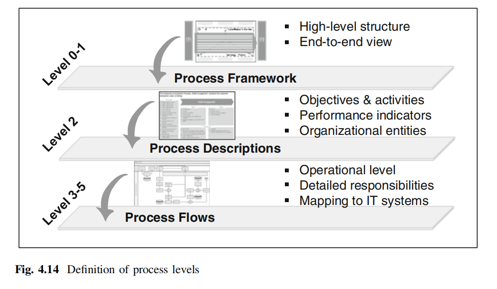
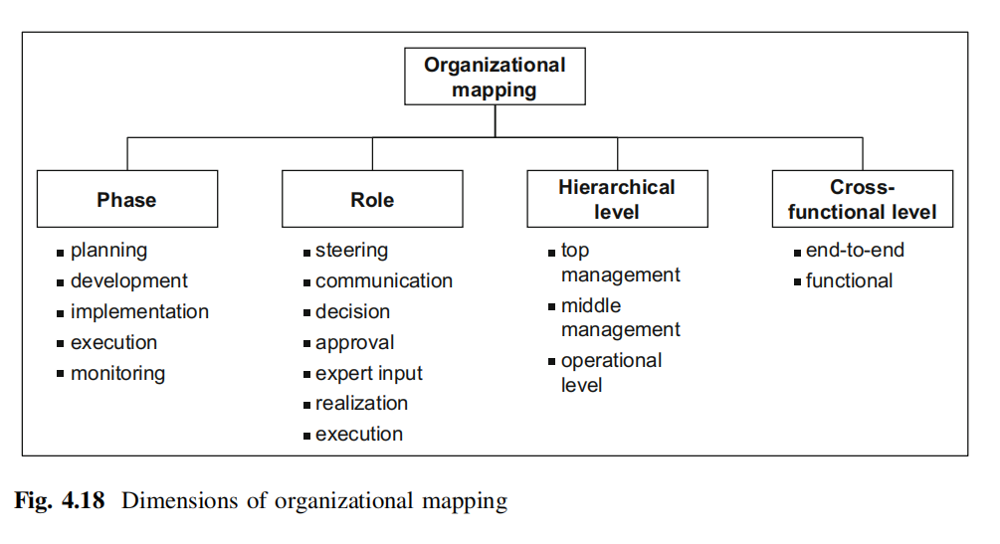
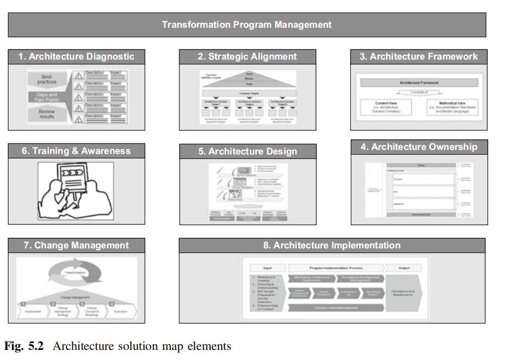

# Telecom market overview

## TM Forum SID Model

Link to TM Forum SID: https://www.tmforum.org/Browsable_HTML_SID_v22.0/html/index.htm

Architecture solution design map

## Today's telecom operators situation in brief

Telecom operation positioning

See: [Value chain](Terms.md#value-chain)

## Telecom market problems
* Price decrease and Cost preasure
* Financial situation
* Emergence of OTT providets 

See: [Telco-OTT](Terms.md#ott)
Strategic response to OTT:
* Accept OTT Services
* Attack or absorb OTT Service
* PArtner with OTT Provider

## Growth Potential in Vertical Markets
. Telecommunications operators could address these challenges
by generating new revenue streams in non-telecommunications business areas. The common vertical markets named by most telecommunications operators are
* automotive
* banking
* consumer packaged goods
* education
* energy and utilities
* government, healthcare
* insurance
* manufacturing
*  mining
*  public sector
*  retail
*  transportation and logistics
*  smart home.
  Cloud-based solutions and Machine-to-Machine (M2M) solutions are, for instance, services that can be offered
to various verticals

Several elements are required for telecommunications operators who decide to
enter vertical markets including (Sapien 2011, p. 4):
• transformation capabilities beyond telecommunications;
• overview of product demands for vertical markets;
• innovative products and services to be offered;
• product development team with vertical knowledge;
• strong partner network for different verticals; and
• direct or indirect sales channels.

## Problems that telco meeets in vertical markets
* LAck of vertical knowledge
* Difficulty in developing of vertical products
* Presence of global copetitors
* LAck of global scale

Telecommunications operators are transitioning from a product-centric approach, in which all customers are offered the same service, to a customer-centric one. Customer-centric approach means designing customized
solutions, tailored to the needs of each customer or customer-segment, which could be a specific vertical industry. Customized services will allow telecommunications
operators to distinguish themselves and market unique solutions. This approach also changes the way telecommunications operators are organized.

### Vertical 1—Machine-to-Machine (M2M)

### Vertical 2—Cloud Computing

* SaaS
* PaaS
* IaaS

### Healthcare

### Vertical 4—Automotive

# Telecommunications Products and Services

Telecommunication services are services that are usually provided fully or predominantly in telecommunication networks.

# Telecomminication value chain
The value creation in the telecommunications industry is heavily influenced by new players, such as content and applications provider

The resulting erosion of the traditional value chain is discussed in Sect. 2.3.1. A reaction of telecommunications
operators is the establishment of new partnerships

For a long time, the focus of the telecommunications industry has been on the
transmission of information over long-distance networks. The transmission was
mainly focused on the technically correct transmission of signals. A major part of
the value creation of a telecommunications operator was the roll-out and operations
of the required network infrastructure. Those communications networks were
related to extensive long-term investments, which served as an enormous market
entry barrier for new competitors. The requisite skillset was mainly related to
communications engineering.

Establishing partnerships between telecommunications operators is becoming more
important. In the past, telecommunications operators have mainly concentrated on
moving their own business forward without taking partnerships with other operators
seriously into consideration. The situation has changed and leading telecommunications operators are becoming more open to establish strategic partnerships for
high priority business areas.

The core elements of a strategic partnership framework between telecommunications operators with increasing mutual responsibility include:
• general knowledge sharing and transfer;
• regular site visits;
• joint business models;
• joint market and sales approach for products/services; and
• revenue and investment sharing.
Selected advantages for the telecommunications operators are:
• benefit from existing solutions of the other operator;
• joint product development and innovation activities;
• reduction of product development cost;
• new and innovative business models;
• potential to enter new regional markets; and
• footprint extension for own products and services.

### Partnership establishmenet 
* Framework agreement
* PArtnetship agreements
* Joint ventures
  
***ex. Deutsche Telekom and Orange***

## OSS BSS
OSS are those systems that support the operations and
maintenance of telecommunication networks

BSS cover systems that are necessary to manage and offer products, as well as to
answer customer requests and to react on reported problems. These systems include
the typical sales and marketing functions. A Customer Relationship Management
(CRM) system is a typical software system that is part of the BSS.

In summary (cf. Fig. 4.6), OSS can be seen as production systems that manage
the production resources and infrastructure. BSS provide the link between those
production systems to the clients. The interrelation between both BSS and OSS is
one of the major success factors for an efficient mastering of the technological and
market-related complexity. In an ideal architecture, OSS encapsulate all technical
details of the production. On the other hand, the BSS encapsulate all details related
to the clients.

In addition to BSS and OSS, further application systems are required to support
the corporate management, the supply chain, as well as the administrative and
support activities

  
 # Unstructured material 

FOGAF neewd to see

According to the aforementioned structuring of activities, the following domains
are proposed

• Customer-centric domain contains all primary activities, such as sales and
customer service. These processes are defined from an end-to-end perspective
always starting and ending with the customer.
• Technology domain covers the roll-out, extension, operations, and maintenance
of the network infrastructure as well as the development and realization of
telecommunication services.
• Product domain contains the development and launch of telecommunication
products based on the services provided by the technology domain.
• Customer domain focuses on marketing activities, such as market research or
campaigns. In contrast to the customer-centric domain, the processes of the
customer domain support customer-related activities, such as preparing successful sales through marketing campaigns.
• Support domain contains all general support activities, such as finance or human
resource management

Processes describe the How, while the organizational structure defines the Who

