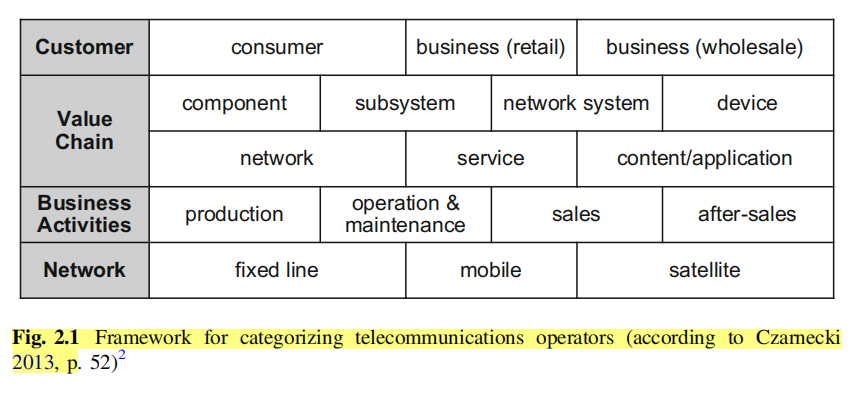

# Telecom market overview

## TM Forum SID Model

Link to TM Forum SID: https://www.tmforum.org/Browsable_HTML_SID_v22.0/html/index.htm

Architecture solution design map

## Today's telecom operators situation in brief

Telecom operation positioning

See: [Value chain](Terms.md#value-chain)

## Telecom market problems
* Price decrease and Cost preasure
* Financial situation
* Emergence of OTT providets 

See: [Telco-OTT](Terms.md#ott)
Strategic response to OTT:
* Accept OTT Services
* Attack or absorb OTT Service
* PArtner with OTT Provider

## Growth Potential in Vertical Markets
. Telecommunications operators could address these challenges
by generating new revenue streams in non-telecommunications business areas. The common vertical markets named by most telecommunications operators are
* automotive
* banking
* consumer packaged goods
* education
* energy and utilities
* government, healthcare
* insurance
* manufacturing
*  mining
*  public sector
*  retail
*  transportation and logistics
*  smart home.
  Cloud-based solutions and Machine-to-Machine (M2M) solutions are, for instance, services that can be offered
to various verticals

Several elements are required for telecommunications operators who decide to
enter vertical markets including (Sapien 2011, p. 4):
• transformation capabilities beyond telecommunications;
• overview of product demands for vertical markets;
• innovative products and services to be offered;
• product development team with vertical knowledge;
• strong partner network for different verticals; and
• direct or indirect sales channels.

## Problems that telco meeets in vertical markets
* LAck of vertical knowledge
* Difficulty in developing of vertical products
* Presence of global copetitors
* LAck of global scale

Telecommunications operators are transitioning from a product-centric approach, in which all customers are offered the same service, to a customer-centric one. Customer-centric approach means designing customized
solutions, tailored to the needs of each customer or customer-segment, which could be a specific vertical industry. Customized services will allow telecommunications
operators to distinguish themselves and market unique solutions. This approach also changes the way telecommunications operators are organized.

### Vertical 1—Machine-to-Machine (M2M)

### Vertical 2—Cloud Computing

* SaaS
* PaaS
* IaaS

### Healthcare

### Vertical 4—Automotive

# Telecommunications Products and Services

Telecommunication services are services that are usually provided fully or predominantly in telecommunication networks.

  