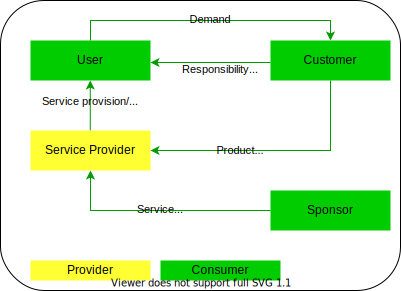
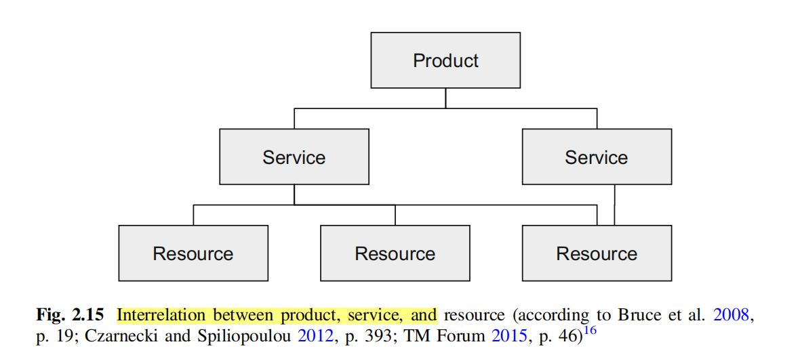
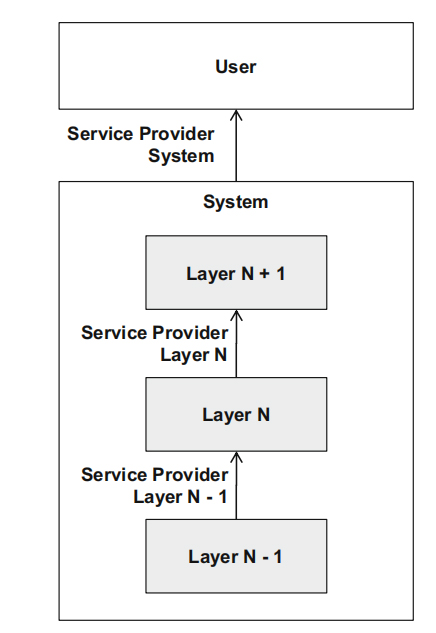
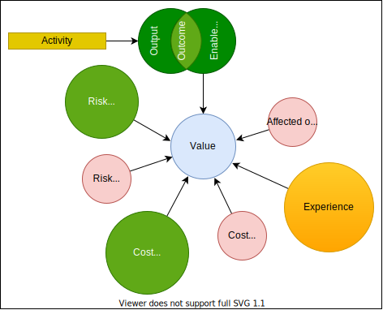

# ITIL concepts
## Consumer

## Product and service

Service provides present their services to consumers in the form of service offerings, which describe one or mode services based on one or mode products.

But other sources may have another view to services

At the same time, a differentiation between a general service (e.g., the installation 
service of a service technician), a technical service (e.g., the transmission service of
a mobile network) and a service as a product (e.g., consisting of general and
technical services) is important. In fact, the term service is used for all three different types.

. From an economic perspective, the telecommunications industry belongs to
the service industry and, accordingly, a service will be provided to the customer
(Zeithaml and Bitner 2003, p. 3). As shown in Fig. 2.14, only a subset of the
services is perceived by the customer. All other services are executed within the
telecommunications network as well as the telecommunications system, and are not
visible to the customer

product should be used to
describe a telecommunication service that is provided to a customer

