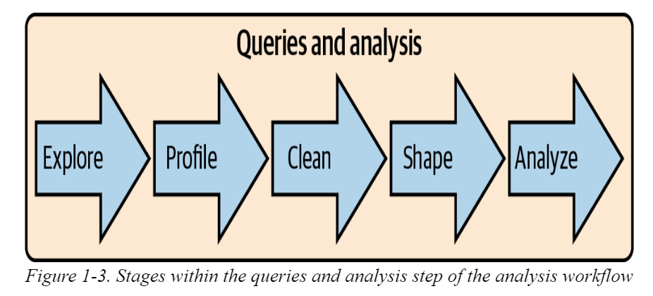

# SQL for data analysis
SQL consists from 4 sublanguages:
1. DQL - Data Query Language
2. DDL - Data Definition Language
3. DCL - Data Conftrol Language
4. DML - Data Manupulation Language



There are 2 types of databases
1. row-stored database
2. column-storesd database

***Row-store databases***—also called transactional databases—are designed to be efficient at processing transactions: INSERTs, UPDATEs, and DELETEs. Popular open source row-store databases include MySQL and Postgres. On the commercial side, Microsoft SQL Server, Oracle, and Teradata are widely used

To reduce the width of tables, row-store databases are usually modeled in third normal form, which is a database design approach that seeks to store each piece of information only once, to avoid duplication and inconsistencies. 

***When doing analysis, the goal is usually denormalization, or getting all the data together in one place.***

Tables typically have a primary key that enforces uniqueness—in other words, it prevents the database from creating more than one record for the same thing

Tables also optionally have indexes that make looking up specific records faster and make joins involving these columns faster

**Column-store databases** took off in the early part of the 21st century, though their theoretical history goes back as far as that of row-store databases. Column-store databases store the values of a column together, rather than storing the values of a row together. This design is optimized for queries that read many records but not necessarily all the columns. Popular column-store databases include Amazon Redshift, Snowflake, and Vertica

Column-store databases are generally the gold standard for fast analysis work. They use standard SQL (with some vendor-specific variations), and in many ways working with them is no different from working with a row-store database in terms of the queries you write. The size of the data matters, as do the computing and storage resources that have been allocated to the database. I have seen aggregations run across millions and billions of records in seconds. This does wonders for productivity.

## Preparing for data analisys
>data scientists spend from 50% to 80% of their time cleaning and wrangling their data. 

Data preparation is easier when a data set has a data dictionary, a document or repository that has clear descriptions of the fields, possible values, how the data was collected, and how it relates to other data

### Datatypes
1. String (Char,varchar, text, blob)
2. Numeric (int,smallint, bigint, fload, decimal,double)
3. logical(Boolean)
4. date (datetime, time, timestamp)

### Structured versus unstructured
 Most databases were designed to handle **structured data**, where each attribute is stored in a column, and instances of each entity are represented as rows.

 When structured data is inserted into a table, each field is verified to ensure it conforms to the correct data type. Structured data is easy to query with SQL
 **Unstructured data** is the opposite of structured data. There is no predetermined structure, data model, or data types.

 **Semistructured data** falls in between these two categories.

## Quantitative Versus Qualitative Data
* Quantitative data is numeric. It measures people, things, and events.
* Qualitative data is usually text based and includes opinions, feelings, and descriptions that aren’t strictly quantitative. 

## First-, Second-, and Third-Party Data
First-party data is collected by the organization itself.
Second-party data comes from vendors that provide a service or perform a business function on the organization’s behalf
Third-party data may be purchased or obtained from free sources such as those published by governments.

## Sparse Data
Sparse data occurs when there is a small amount of information within a larger set of empty or unimportant information. Sparse data might show up as many nulls and only a few values in a particular column. 

HOW NOT TO KILL YOUR DATABASE: LIMIT AND SAMPLING
````
LIMIT is added as the last line of the query, or subquery, and can take any positive integer value:


SELECT column_a, column_b
FROM table
LIMIT 1000
;

Sampling can be accomplished by using a function on an ID field that has a random distribution of digits at the beginning or end. The modulus or mod function returns the remainder when one integer is divided by another. If the ID field is an integer, mod can be used to find the last one, two, or more digits and filter on the result:


WHERE mod(integer_order_id,100) = 6
This will return every order whose last two digits are 06, which should be about 1% of the total. If the field is alphanumeric, you can use a right() function to find a certain number of digits at the end:


WHERE right(alphanum_order_id,1) = 'B'
This will return every order with a last digit of B, which will be about 3% of the total if all letters and numbers are equally common, an assumption worth validating.
````
## Frofiling: distributions
1. Check table name and it's structure (collumn names)
2. Histogram and frequencies

```
SELECT fruit, count(*) as quantity
FROM fruit_inventory
GROUP BY 1
;
# in case of dataset has duplicates
# need use count distinct
```
## Frequency count
```
SELECT orders, count(*) as num_customers
FROM
(
    SELECT customer_id, count(order_id) as orders
    FROM orders
    GROUP BY 1
) a
GROUP BY 1
;
```
## Binning
Measures are grouped to **bins**
```
SELECT 
case when order_amount <= 2 then 'up to 2'
     when order_amount <= 5 then '2-5'
     else '5+' end as amount_bin
,case when order_amount <= 2 then 'small'
      when order_amount <= 5 then 'medium'
      else 'large' end as amount_category
,count(customer_id) as customers
FROM orders
GROUP BY 1,2
;
```
Logarithms are another way to create bins, particularly in data sets in which the largest values are orders of magnitude greater than the smallest values. The distribution of household wealth, the number of website visitors across different properties on the internet, and the shaking force of earthquakes are all examples of phenomena that have this property

```
SELECT log(sales) as bin
,count(customer_id) as customers
FROM table
GROUP BY 1
;
```
## n-Tiles
TBD

# Profiling. Data quality
### Detect duplicates
```
SELECT records, count(*)
FROM
(
    SELECT column_a, column_b, column_c..., count(*) as records
    FROM...
    GROUP BY 1,2,3...
) a
WHERE records > 1
GROUP BY 1
;

OR with having

SELECT column_a, column_b, column_c..., count(*) as records
FROM...
GROUP BY 1,2,3...
HAVING count(*) > 1
;
```

### Deduplication 
```
SELECT distinct a.customer_id, a.customer_name, a.customer_email
FROM customers a
JOIN transactions b on a.customer_id = b.customer_id
;

```
## Preparing: Data Cleaning
## Cleaning Data with CASE Transformations

```
SELECT response_id
,likelihood
,case when likelihood <= 6 then 'Detractor'
      when likelihood <= 8 then 'Passive'
      else 'Promoter'
     end as response_type
FROM nps_responses
;
```

### Type Conversions and Casting

```
cast(replace('$19.99','$','')) as float
```

### Dealing with Nulls: coalesce, nullif, nvl Functions

Nulls are often inconvenient or inappropriate for the analysis you want to do. They can also make output confusing to the intended audience for your analysis.


### Missing data
Таблица может иметь дыры в датах покупки.  проверяем это, соединяя ее со сгенерированной таблицей. 


```
SELECT a.generate_series as order_date, b.customer_id, b.items
FROM
(
    SELECT *
    FROM generate_series('2020-01-01'::timestamp,'2020-12-31','1 day')
) a
LEFT JOIN 
(
    SELECT customer_id, order_date, count(item_id) as items
    FROM orders
    GROUP BY 1,2
) b on a.generate_series = b.order_date
;
```

## Pivoting with CASE Statements
```
SELECT order_date
,sum(case when product = 'shirt' then order_amount 
          else 0 
          end) as shirts_amount
,sum(case when product = 'shoes' then order_amount 
          else 0 
          end) as shoes_amount
,sum(case when product = 'hat' then order_amount 
          else 0 
          end) hats_amount
FROM orders
GROUP BY 1
;
```


-------
# Нормальизация БД
## Первая нормальная форма
[Статья](https://info-comp.ru/first-normal-form)

Правила:
* В таблице не должно быть дублирующих строк
* В каждой ячейке таблицы хранится атомарное значение (одно не составное значение)
* В столбце хранятся данные одного типа
* Отсутствуют массивы и списки в любом виде

## Вторая нормальная форма
[Статья](https://info-comp.ru/second-normal-form)

* Таблица должна находиться в первой нормальной форме
* Таблица должна иметь ключ
* Все неключевые столбцы таблицы должны зависеть от полного ключа (в случае если он составной)
> ***Главное правило:*** *"Таблица должна иметь правильный ключ, по которому можно идентифицировать каждую строку."*

## Третья нормальная форма
[Статья](https://info-comp.ru/third-normal-form)

Требование третьей нормальной формы (3NF) заключается в том, чтобы в таблицах отсутствовала транзитивная зависимость.

>**Транзитивная зависимость** – это когда неключевые столбцы зависят от значений других неключевых столбцов.

Иными словами, неключевые столбцы не должны пытаться играть роль ключа в таблице, т.е. они действительно должны быть неключевыми столбцами, такие столбцы не дают возможности получить данные из других столбцов, они дают возможность посмотреть на информацию, которая в них содержится, так как в этом их назначение.


---------
### Topics for review
* [star schema modeling](https://en.wikipedia.org/wiki/Star_schema)
* Snowflake schema
* n-tile function. 